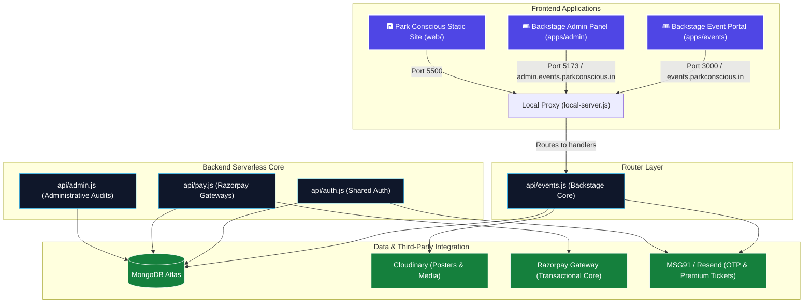

# 🏢 Backstage & Park Conscious Monorepo

Welcome to the central developer guide. This repository is built as a **Turborepo-powered Monorepo**, containing two distinct projects with separate business scopes:

1. **Backstage (Main Event Suite):** A high-performance smart ticketing and event hosting platform for creators and small/medium venues.
2. **Park Conscious (Parking Portal):** An independent smart-city static site and parking lot allocation system.

---

## 🚨 Domain & Scope Distinction (CRITICAL)

To prevent confusion when onboarding, it is important to understand that the repository houses two separate domains:

### 🎟️ 1. Backstage Suite (The Core Ticketing Product)
This is the main product domain. All active development for event ticketing, dynamic checkouts, and organizer self-service onboarding happens here:
*   **Customer Event Portal (`apps/events`):** The primary client-facing Vite/React web application.
*   **Organizer Admin Panel (`apps/admin`):** The administrator and organizer dashboard for tracking sales, checking in guests, and building event threads.
*   **Backend Serverless Handlers:** `api/events.js`, `api/pay.js` (Razorpay gateway integration), and `api/lib/email.js` (ticket pass dispatchers).

### 🅿️ 2. Park Conscious (Independent Parking Project)
This is a separate smart parking product that operates independently of the Backstage ticketing ecosystem:
*   **Static Website (`web/`):** The landing page and owner-specific login dashboards (`web/owner/`).
*   **AI Parking Engine:** Python allocation services (`api/engine/allocator`) and legacy Express routes (`services/`).
*   *Note: This project is outside the domain and scope of the Backstage events system.*

---

## 🗺️ System Architecture



---

## 📂 Monorepo Repository Structure

```text
├── apps/                        # Decoupled Frontend Applications
│   ├── events/                  # [Backstage] Customer Event Portal (Vite/React + SWR)
│   └── admin/                   # [Backstage] Organizer Administrative Panel (Vite/React)
├── packages/                    # Shareable Workspace Modules
│   └── database/                # Shared DB models, MongoDB connections, and email modules
├── web/                         # [Park Conscious] Main static website & owner portal dashboards
├── api/                         # Backend Serverless API Handlers (Production Vercel Functions)
│   ├── auth.js                  # Shared JWT encryption & OAuth validations
│   ├── events.js                # [Backstage] Core events API, unique SEO slugs, & discussions
│   ├── pay.js                   # [Backstage] Razorpay checkouts & callback webhooks
│   └── admin.js                 # Global management endpoints
├── services/                    # Background processes and core engines
│   └── core/                    # [Park Conscious] OCR plate reading & parking slot allocation
├── local-server.js              # High-fidelity Local Dev Server Proxy (Simulates Vercel environments)
├── package.json                 # Global dependencies & workspaces configuration
└── vercel.json                  # Production Routing rules, subdomains, & rewriting map
```

---

## 🚀 Getting Started

### 📋 Prerequisites
Make sure your development machine has the following tools installed:
* **Node.js**: v18.0.0 or higher
* **NPM**: v9.0.0 or higher (required for workspaces support)
* **MongoDB**: A local MongoDB database or a MongoDB Atlas connection string

---

### 💻 Step-by-Step Local Setup

#### 1. Clone & Install Dependencies
First, clone the repository to your local machine. From the root directory, install all global and workspace dependencies concurrently:
```bash
npm install
```

#### 2. Environmental Variables Configuration
You must configure environment variables at both the **root** and the **individual frontend** levels.

##### 🔹 Root Level (`.env`)
Create a `.env` file in the root of the project:
```env
MONGODB_URI="mongodb+srv://..."   # MongoDB Atlas Connection URI
JWT_SECRET="your-super-secret"    # Key used to sign JWT Session cookies
RESEND_API_KEY="re_..."           # Token for sending email communications
MSG91_AUTH_KEY="your-auth-key"    # MSG91 Token for transactional mail & SMS OTPs
RAZORPAY_KEY_ID="rzp_test_..."    # Razorpay Merchant ID for checkouts
RAZORPAY_KEY_SECRET="..."         # Razorpay merchant private secret
```

##### 🔹 Events App Level (`apps/events/.env.local`)
Create a `.env.local` inside the `apps/events` folder:
```env
REACT_APP_API_BASE_URL="http://localhost:3001"
```

---

### 🏃 Running Backstage & Park Conscious Locally

To make local development as simple as possible, npm workspace scripts are mapped at the root directory:

#### 1. Start the Local Backend API Proxy Server
Backstage uses a specialized local proxy (`local-server.js`) that mimics the Vercel production hosting environment, bypassing CORS constraints and supporting hot-reloading:
```bash
npm run dev:backend
```
*This spins up the backend API on **`http://localhost:3001`**.*

#### 2. Start the Frontend Applications
In a new terminal window, boot all frontend clients concurrently:
```bash
npm run dev
```
* **Backstage Events Customer Portal**: Accessible at [http://localhost:3000](http://localhost:3000)
* **Backstage Admin Dashboard**: Accessible at [http://localhost:5173](http://localhost:5173)

---

## 🛠️ Code Standards & Rules

To maintain database security, robust routing, and clean styling, follow these strict coding practices:

### 1. Unified Schema & Database Access
* **Always use the Shared models file:** Database schemas are centralized in `api/lib/models.js`. Do not define custom models inside endpoint files.
* **Race-Free Slug Generation:** When saving events, always use our safe duplicate-retry loop wrapping `Event.create()` to resolve unique SEO slug collisions gracefully using caught `E11000` Mongo codes.
* **GET Priority Lookup:** Always structure single event looks to prioritize slug lookups (`Event.findOne({ slug })`). Only fall back to `_id` search if the slug is missing to prevent 24-character slugs from colliding with ObjectIds.

### 2. High-Performance Frontends (SWR)
* **No Inline Fetches:** All API calls in `apps/events` must be managed using SWR hook integrations. This provides caching, auto-revalidation, and extremely fast visual loads.
* **Prefetch on Hover:** Preload critical event details using `preload` methods on hovering over event posters (`Poster.Component.jsx`) to create an instantaneous visual transit.

### 3. Bulletproof Emails & OTPs
* **Premium Pass Templates:** Ticket notifications must be rendered using our rich HTML template (`api/lib/email.js` -> `processTicketEmail`), which generates clean QR blocks, venue locations, and guest credentials.
* **XML Escaping:** Ensure sitemap variables are strictly escaped using `escapeXml` before interpolation.

---

## 🚀 Production Deployment Workflow

Production hosting is managed on **Vercel**. 

> [!WARNING]
> Because the codebase is configured as a Monorepo, you must specify correct **Root Directory overrides** inside the Vercel project configuration dashboard:
> * **Main Website Portal**: `.` (Root)
> * **Events Portal**: `apps/events`
> * **Admin Panel**: `apps/admin`

Happy Coding! If you have questions about payment gateway webhooks or database transactions, please consult the core developers before pushing to staging. 🚀
