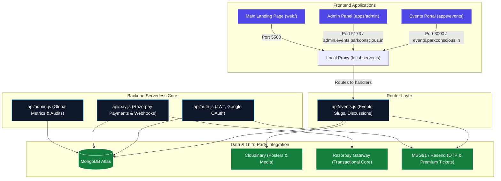

# 🏢 Backstage (Park Conscious)

Welcome to **Backstage** (Park Conscious), a high-performance event management, smart ticketing, and parking platform designed for modern cities and creators. 

This repository is built as a **Turborepo-powered Monorepo**, bringing together multiple frontends (React Apps, static landing pages) and centralized serverless backend services (Node.js API, secure transaction gateway).

This guide is designed to help new engineers quickly understand the technical architecture, set up the development environment, and ship clean, highly optimized code.

---

## 🗺️ System Architecture

Backstage is architected around a unified **Serverless catch-all backend** and a decoupled **Vite/React frontend portal** utilizing cross-subdomain authentication.



---

## 📂 Monorepo Repository Structure

The project is structured to enforce strong separation of concerns, rapid builds, and seamless local development:

```text
├── apps/                        # Decoupled React Client Applications
│   ├── events/                  # High-performance Customer Events Portal (Vite/React + SWR)
│   └── admin/                   # Secure Internal Administrative Panel (Vite/React)
├── packages/                    # Shareable Workspace Modules
│   └── database/                # Shared DB models, MongoDB connections, and email modules
├── web/                         # Main landing page & owner-specific portals (Vanilla HTML/JS)
├── api/                         # Backend Serverless API Handlers (Production Vercel Functions)
│   ├── auth.js                  # Authentication, JWT encryption, & OAuth validations
│   ├── events.js                # Core events API, unique SEO slug generator, & thread discussion boards
│   ├── pay.js                   # Razorpay API transaction hooks & callback webhooks
│   └── admin.js                 # Global management endpoints
├── services/                    # Background processes and core engines
│   └── core/                    # Processing modules (QR ticket scanning & plate reading)
├── local-server.js              # High-fidelity Local Dev Server Proxy (Simulates Vercel environments)
├── package.json                 # Global dependencies & workspaces configuration
└── vercel.json                  # Production Routing rules, subdomains, & rewriting map
```

---

## 🚀 Getting Started

### 📋 Prerequisites
Make sure your development machine has the following tools installed:
* **Node.js**: v18.0.0 or higher
* **NPM**: v9.0.0 or higher (required for workspaces support)
* **MongoDB**: A local MongoDB database or a MongoDB Atlas connection string

---

### 💻 Step-by-Step Local Setup

#### 1. Clone & Install Dependencies
First, clone the repository to your local machine. From the root directory, install all global and workspace dependencies concurrently:
```bash
npm install
```

#### 2. Environmental Variables Configuration
You must configure environment variables at both the **root** and the **individual frontend** levels.

##### 🔹 Root Level (`.env`)
Create a `.env` file in the root of the project:
```env
MONGODB_URI="mongodb+srv://..."   # MongoDB Atlas Connection URI
JWT_SECRET="your-super-secret"    # Key used to sign JWT Session cookies
RESEND_API_KEY="re_..."           # Token for sending email communications
MSG91_AUTH_KEY="your-auth-key"    # MSG91 Token for transactional mail & SMS OTPs
RAZORPAY_KEY_ID="rzp_test_..."    # Razorpay Merchant ID for checkouts
RAZORPAY_KEY_SECRET="..."         # Razorpay merchant private secret
```

##### 🔹 Events App Level (`apps/events/.env.local`)
Create a `.env.local` inside the `apps/events` folder:
```env
REACT_APP_API_BASE_URL="http://localhost:3001"
```

---

### 🏃 Running Backstage Locally

To make local development as simple as possible, npm workspace scripts are mapped at the root directory:

#### 1. Start the Local Backend API Proxy Server
Backstage uses a specialized high-fidelity router (`local-server.js`) that mimics the Vercel production hosting environment, bypassing CORS constraints and supporting hot-reloading:
```bash
npm run dev:backend
```
*This spins up the backend API on **`http://localhost:3001`**.*

#### 2. Start the Frontend Applications
In a new terminal window, boot all React frontends concurrently (Admin & Events Portal):
```bash
npm run dev
```
* **Events Customer Portal**: Accessible at [http://localhost:3000](http://localhost:3000)
* **Admin Dashboard**: Accessible at [http://localhost:5173](http://localhost:5173)

---

## 🛠️ Code Standards & Rules (Must Read for New Grads)

To maintain database security, robust routing, and clean styling, follow these strict coding practices:

### 1. Unified Schema & Database Access
* **Always use the Shared models file:** Database schemas are centralized in `api/lib/models.js`. Do not define custom models inside endpoint files.
* **Race-Free Slug Generation:** When saving events, always use our safe duplicate-retry loop wrapping `Event.create()` to resolve unique SEO slug collisions gracefully using caught `E11000` Mongo codes.
* **GET Priority Lookup:** Always structure single event looks to prioritize slug lookups (`Event.findOne({ slug })`). Only fall back to `_id` search if the slug is missing to prevent 24-character slugs from colliding with ObjectIds.

### 2. High-Performance Frontends (SWR)
* **No Inline Fetches:** All API calls in `apps/events` must be managed using SWR hook integrations. This provides caching, auto-revalidation, and extremely fast visual loads.
* **Prefetch on Hover:** Preload critical event details using `preload` methods on hovering over event posters (`Poster.Component.jsx`) to create an instantaneous visual transit.

### 3. Bulletproof Emails & OTPs
* **Premium Pass Templates:** Ticket notifications must be rendered using our rich HTML template (`api/lib/email.js` -> `processTicketEmail`), which generates clean QR blocks, venue locations, and guest credentials.
* **XML Escaping:** Ensure sitemap variables are strictly escaped using `escapeXml` before interpolation.

---

## 🚀 Production Deployment Workflow

Production hosting is managed on **Vercel**. 

> [!WARNING]
> Because the codebase is configured as a Monorepo, you must specify correct **Root Directory overrides** inside the Vercel project configuration dashboard:
> * **Main Website Portal**: `.` (Root)
> * **Events Portal**: `apps/events`
> * **Admin Panel**: `apps/admin`

Happy Coding! If you have questions about payment gateway webhooks or database transactions, please consult the core architects before pushing to staging. 🚀
